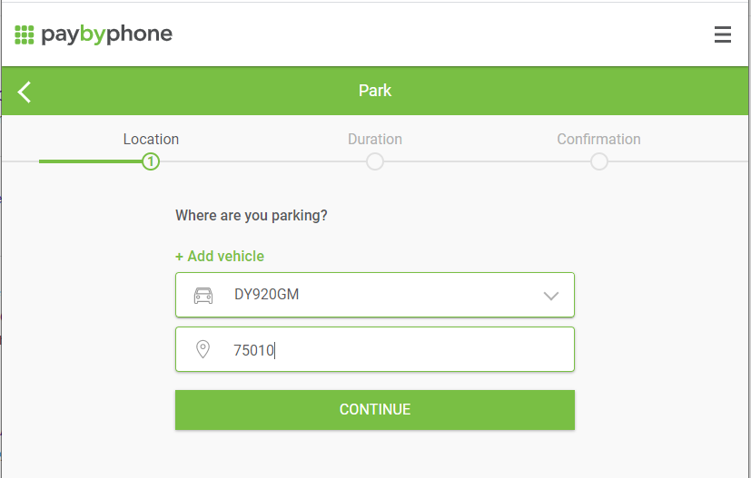

# Parktop
In Paris and a few other cities it is now possible to pay parking meter online on paybyphone.fr. This package 
allows you to automate this payment. It is based on the selenium web driver.



## Installation

```sh
pip install parktop
```

## Release History

* 1.0.0
    * First stable version.

## Meta

Anatole Callies – anatole@callies.fr

Distributed under the Apache License 2.0. See ``LICENSE`` for more information.

[https://github.com/anatolec/](https://github.com/anatolec/)
